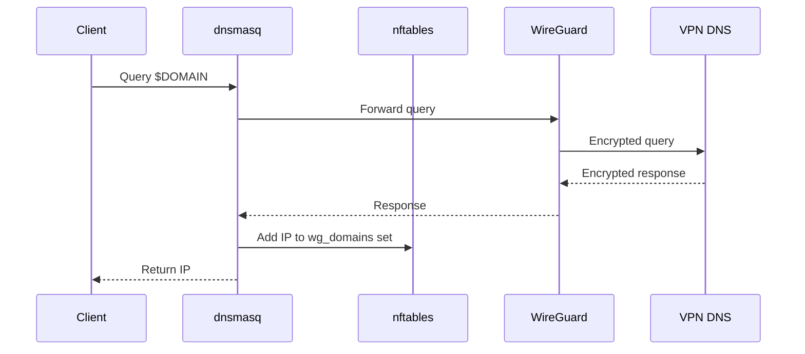
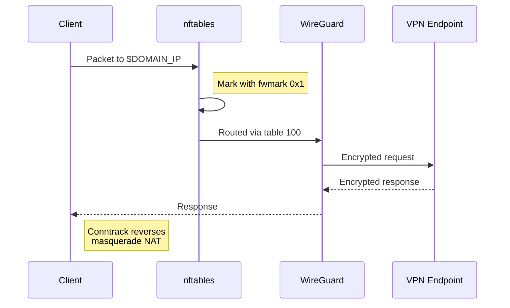
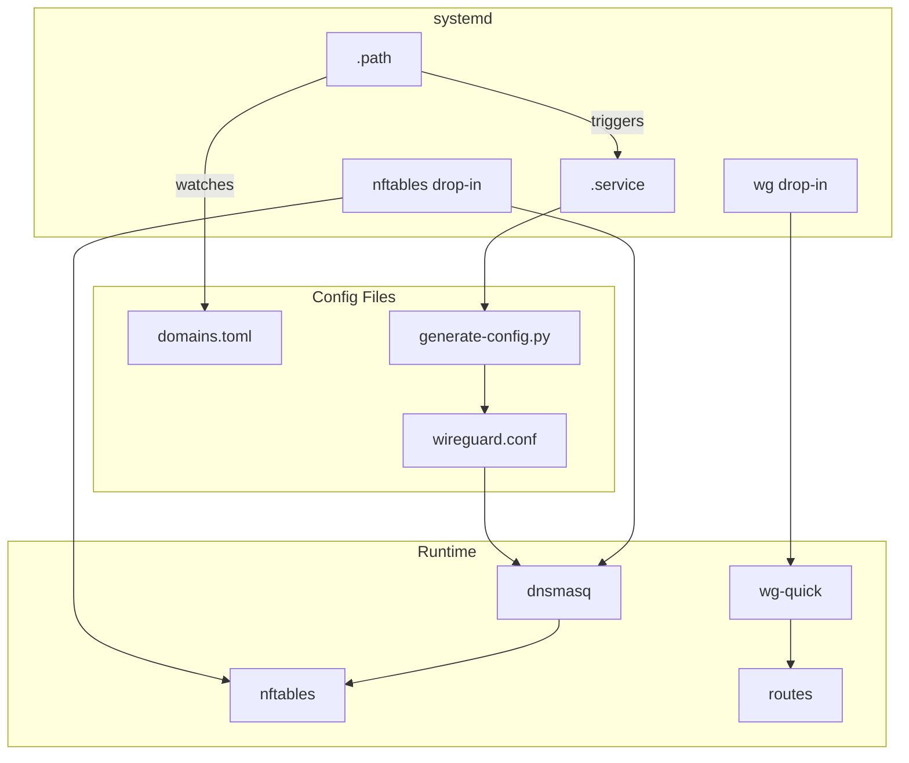

Split tunneling lets you route some traffic through a VPN while the rest uses your regular connection. Using WireGuard, the typical approach is to hardcode IP ranges into your config - but this breaks down quickly. CDN providers rotate IPs constantly, services span multiple autonomous systems, and maintaining static IP lists becomes a game of whack-a-mole.

This guide implements **domain-based split tunneling** on Linux: specify domains you want tunneled, and the system dynamically routes traffic to those domains through WireGuard regardless of what IPs they resolve to. The stack involves `dnsmasq` (DNS interception and `nftables` set population), `nftables` (packet marking), policy routing (fwmark-based table selection), and connection tracking (to preserve long-lived connections).

> <details>
> <summary><strong>What's <code>nftables</code>?</strong></summary>
>
> `nftables` is the Linux kernel's packet filtering framework - the successor to `iptables` that handles packet classification, filtering, and manipulation.
>
> A *set* is a data structure that `nftables` can efficiently match against during packet processing. In this setup, sets act as dynamic allowlists: when a packet's destination IP exists in `wg_domains4` or `wg_domains6`, `nftables` can apply special handling (like marking it for policy routing). Sets support timeouts, so stale IPs automatically expire and get re-added on the next DNS query.
>
> </details>

We'll also route DNS queries for tunneled domains through WireGuard itself. If you're tunneling traffic to a domain, the DNS lookup should go through the tunnel too - otherwise you're leaking which domains you're accessing. This also bypasses ISP DNS hijacking, which is more common than you'd hope.

> <details>
> <summary><strong>Why not just use 1.1.1.1?</strong></summary>
>
> You might think "I'll just use 1.1.1.1 instead of my ISP's DNS." Adorable. Many ISPs do deep packet inspection on **all** port 53 traffic, not just queries to their own resolvers. When you send a DNS query to Cloudflare, your ISP intercepts the packet, inspects the domain, and if it's on their naughty list, returns a sinkhole IP instead. Your query never reaches Cloudflare at all.
>
> As of December 29th, 2025, running these commands in India returns:
>
> ```bash
> # DNS query over port 53
> $ dig +short tiktok.com @1.1.1.1
> 123.176.40.67
>
> # DNS query over HTTPS (port 443)
> $ curl -s -H 'accept: application/dns-json' 'https://cloudflare-dns.com/dns-query?name=tiktok.com&type=A'
> 23.65.124.96
> ```
>
> The first result (`123.176.40.67`) is [a known ISP sinkhole](https://github.com/cis-india/censorwatch/blob/2a50e3907c95f53c1e28b0261e53a38a54786d0f/analysis_scripts/confirm_DNS_blocks.R#L1). The second (`23.65.124.96`) is TikTok's actual IP. If they return different IPs, your ISP is lying to you. The fix? Encrypt the DNS query. You could use DoH or DoT, but since we're already tunneling traffic through WireGuard, we might as well route DNS through it too. One tunnel to rule them all.
>
> </details>

## Table of Contents

<nav>
<ul>
<li><a href="#how-it-works">How It Works</a>
<ul>
<li><a href="#stage-1-dns-resolution">Stage 1: DNS Resolution</a></li>
<li><a href="#stage-2-traffic-routing">Stage 2: Traffic Routing</a></li>
</ul>
</li>
<li><a href="#how-its-set-up">How Its Set Up</a>
<ul>
<li><a href="#prerequisites">Prerequisites</a></li>
<li><a href="#configuration-files">Configuration Files</a></li>
<li><a href="#putting-it-together">Putting It Together</a></li>
<li><a href="#testing">Testing</a></li>
<li><a href="#tailscale-integration">Tailscale Integration</a></li>
<li><a href="#reverting">Reverting</a></li>
</ul>
</li>
<li><a href="#conclusion">Conclusion</a></li>
</ul>
</nav>

## How It Works

### Stage 1: DNS Resolution

When the client makes a DNS query for a tunneled domain, the following happens:

1. **Local interception**: `dnsmasq` listens on both `127.0.0.53` (the standard systemd-resolved stub address) and `127.0.0.1`. Applications using the system resolver hit `127.0.0.53`, while applications attempting to bypass system DNS (e.g., querying `8.8.8.8` directly) are redirected to `127.0.0.1:53` by the `output_nat` chain. Either way, `dnsmasq` receives the query and checks its configuration for domain-specific rules.

   > <details>
   > <summary><strong>How bypass attempts are captured</strong></summary>
   >
   > The `output_nat` chain intercepts outgoing DNS traffic before it leaves the system:
   >
   > ```bash
   > nft add chain inet wg_routing output_nat "{ type nat hook output priority -100; }"
   > nft add rule inet wg_routing output_nat meta skuid != 0 udp dport 53 redirect to :53
   > nft add rule inet wg_routing output_nat meta skuid != 0 tcp dport 53 redirect to :53
   > ```
   >
   > Any process (except root) sending DNS queries to port 53 - regardless of destination IP - gets redirected to `127.0.0.1:53` where `dnsmasq` is listening. The `meta skuid != 0` exception is critical: `dnsmasq` runs as root and needs to query upstream DNS servers without being redirected back to itself.
   >
   > ```mermaid
   > sequenceDiagram
   >     participant Client
   >     participant nftables
   >     participant dnsmasq
   >
   >     Client->>nftables: 8.8.8.8:53
   >     Note right of nftables: output_nat catches all<br/>outbound port 53 traffic
   >     nftables->>dnsmasq: redirect
   > ```
   >
   > </details>

2. **Upstream selection**: For tunneled domains, the `server=/${DOMAIN}/${VPN_DNS}` directive tells `dnsmasq` to forward the query to a DNS server running on the VPN endpoint (e.g., `10.1.0.1`). Since this IP is only reachable through the WireGuard tunnel, the DNS query naturally routes through the VPN - no special `nftables` marking required. This prevents ISP interception of DNS queries for tunneled domains.

3. **Response handling**: The DNS response arrives through the WireGuard tunnel, containing the resolved IP address(es) for the domain.

4. **Set population**: The `nftset=/${DOMAIN}/4#inet#wg_routing#wg_domains4,6#inet#wg_routing#wg_domains6` directive instructs `dnsmasq` to add resolved IPv4 addresses to `wg_domains4` and IPv6 addresses to `wg_domains6`. This happens transparently - the client receives a normal DNS response, unaware that the IPs have been flagged for special routing.



### Stage 2: Traffic Routing

When the client sends a packet to that IP, the following happens:

1. **`nftables` matching**: The packet's destination IP is checked against the `wg_domains4` set (for IPv4) or `wg_domains6` set (for IPv6). If it matches, `nftables` applies a *fwmark* (firewall mark) of `0x1` to the packet. An fwmark is a kernel-level metadata tag attached to the packet - it doesn't modify the packet itself, but allows other subsystems to make decisions based on it.

2. **Policy routing**: Linux supports multiple routing tables, not just the default one. A *policy routing rule* checks for packets with fwmark `0x1` and directs them to routing table `100` instead of the main table. Table `100` has a default route through the WireGuard interface (`wg0`).

3. **WireGuard encryption**: The packet is encrypted and encapsulated by WireGuard, then sent to the VPN endpoint.

4. **Return path**: The response arrives through the WireGuard tunnel. *Masquerade NAT* (source NAT using the outgoing interface's IP) ensures the response is translated back to the original client, so the application receives it transparently.



## How Its Set Up

### Prerequisites

- Linux with kernel 5.6+ (WireGuard built-in)
- `dnsmasq` 2.87+ with nftset support
- `nftables` 0.9.4+
- `conntrack` (for flushing connection tracking on config changes)
- A working WireGuard VPN endpoint with a DNS resolver listening on its WireGuard interface (e.g., `10.1.0.1:53`). Most routers running OpenWRT already have `dnsmasq` configured this way.

### Configuration Files

1. **`/etc/resolv.conf`**

   First, back up your existing resolver configuration:

   ```bash
   sudo cp /etc/resolv.conf /etc/resolv.conf.bak
   ```

   Then replace it with:

   ```ini
   nameserver 127.0.0.53
   ```

   This file tells applications where to send DNS queries. It **must** point to `dnsmasq` (`127.0.0.53`) for the split tunnel to work.

   > <details>
   > <summary><strong>Why this matters</strong></summary>
   >
   > If `/etc/resolv.conf` points to your router (e.g., `192.168.0.1`) or any other DNS server, queries bypass `dnsmasq` entirely. The `nftables` sets never get populated with resolved IPs, so packets aren't marked for policy routing - traffic that should be tunneled goes out your regular connection instead.
   >
   > You can verify this yourself: flush the sets with `sudo nft flush set inet wg_routing wg_domains4`, then `curl` a tunneled domain. With `nameserver 192.168.0.1`, you'll see your real IP. With `nameserver 127.0.0.53`, the set gets repopulated and traffic routes through WireGuard.
   >
   > </details>

2. **`/etc/systemd/resolved.conf.d/no-stub.conf`**

   By default, `systemd-resolved` runs a stub DNS listener on `127.0.0.53:53`. We need to disable it so `dnsmasq` can bind to that address instead.

   ```ini
   [Resolve]
   DNSStubListener=no
   ```

3. **`/etc/wireguard/domains.toml`**

   ```toml
   [dns]
   # DNS server on VPN endpoint (only reachable through tunnel)
   tunneled = ["10.1.0.1"]
   # DNS servers for non-tunneled domains (regular internet)
   default = ["9.9.9.9", "149.112.112.112"]

   [tunneled]
   domains = [
     "github.com",
     "icanhazip.com",
     # Add your domains here
   ]
   ```

   The key insight: `10.1.0.1` is a private IP on the WireGuard subnet - it's only reachable through the tunnel. DNS queries to this address naturally route through the VPN without any `nftables` marking. Non-tunneled domains use public DNS servers (`9.9.9.9`) which route through your regular internet connection.

4. **`/etc/wireguard/generate-config.py`**

   ```python
   #!/usr/bin/env python3
   import tomllib
   from pathlib import Path

   TOML_PATH = Path("/etc/wireguard/domains.toml")
   OUTPUT_PATH = Path("/etc/dnsmasq.d/wireguard.conf")

   def main():
     with open(TOML_PATH, "rb") as f:
       config = tomllib.load(f)

     tunneled_dns = config["dns"]["tunneled"]
     default_dns = config["dns"]["default"]
     domains = config["tunneled"]["domains"]

     lines = [
       "#",
       "# DO NOT EDIT THIS FILE",
       "#",
       "# It is automatically generated by generate-config.py using",
       "# settings from /etc/wireguard/domains.toml",
       "#",
       "",
       "user=root",
       "",
     ]

     for domain in domains:
       lines.extend(f"server=/{domain}/{server}" for server in tunneled_dns)
       lines.append(f"nftset=/{domain}/.{domain}/4#inet#wg_routing#wg_domains4,6#inet#wg_routing#wg_domains6")

     lines.extend([
       "",
       "listen-address=127.0.0.1",
       "listen-address=127.0.0.53",
       "port=53",
       "bind-interfaces",
       "no-resolv",
       *[f"server={server}" for server in default_dns],
       "cache-size=1000",
     ])

     OUTPUT_PATH.write_text("\n".join(lines) + "\n")
     print(f"Generated {OUTPUT_PATH}")

   if __name__ == "__main__":
     main()
   ```

5. **`/etc/systemd/system/dnsmasq.service.d/nftables.conf`**

   This is a systemd drop-in file. Instead of modifying the original `dnsmasq.service` unit file (which would get overwritten on package updates), you create a `<service>.d/` directory and put `.conf` files in it. Systemd merges these with the main unit file, letting you add `ExecStartPre` commands to set up the `nftables` infrastructure before `dnsmasq` starts.

   ```ini
   [Service]
   ExecStartPre=/usr/sbin/nft add table inet wg_routing
   ExecStartPre=/usr/sbin/nft add set inet wg_routing wg_domains4 "{ type ipv4_addr; flags interval,timeout; timeout 60m; }"
   ExecStartPre=/usr/sbin/nft add set inet wg_routing wg_domains6 "{ type ipv6_addr; flags interval,timeout; timeout 60m; }"
   ExecStartPre=/usr/sbin/nft add chain inet wg_routing output "{ type route hook output priority mangle; }"
   ExecStartPre=/usr/sbin/nft add rule inet wg_routing output ip daddr @wg_domains4 ct state new meta mark set 0x1 ct mark set meta mark
   ExecStartPre=/usr/sbin/nft add rule inet wg_routing output ip6 daddr @wg_domains6 ct state new meta mark set 0x1 ct mark set meta mark
   ExecStartPre=/usr/sbin/nft add rule inet wg_routing output ct mark 0x1 meta mark set ct mark
   ExecStartPre=/usr/sbin/nft add chain inet wg_routing postrouting "{ type nat hook postrouting priority srcnat; }"
   ExecStartPre=/usr/sbin/nft add rule inet wg_routing postrouting oifname "wg0" masquerade
   ExecStartPre=/usr/sbin/nft add chain inet wg_routing output_nat "{ type nat hook output priority -100; }"
   ExecStartPre=/usr/sbin/nft add rule inet wg_routing output_nat meta skuid != 0 udp dport 53 redirect to :53
   ExecStartPre=/usr/sbin/nft add rule inet wg_routing output_nat meta skuid != 0 tcp dport 53 redirect to :53
   ExecStopPost=-/usr/sbin/nft delete table inet wg_routing
   ```

   The `output_nat` chain redirects all DNS traffic (port 53) to the local dnsmasq instance, preventing applications from bypassing system DNS by querying external servers directly (e.g., `8.8.8.8`). The `meta skuid != 0` condition excludes traffic from root (UID 0) - this is critical because dnsmasq runs as root and needs to query upstream DNS servers without being redirected back to itself.

   > <details>
   > <summary><strong>Limitation: DNS-over-HTTPS bypasses this</strong></summary>
   >
   > The DNS redirect only captures port 53 traffic. Applications using DNS-over-HTTPS (DoH) send DNS queries over port 443, bypassing `dnsmasq` entirely. If Firefox or Chrome has DoH enabled, queries for tunneled domains won't populate the `nftables` sets, and traffic won't be routed through WireGuard.
   >
   > To disable DoH:
   > - **Firefox**: `about:config` → set `network.trr.mode` to `0`
   > - **Chrome**: `chrome://settings/security` → disable "Use secure DNS"
   >
   > Command-line tools like `curl` and `dig` use standard DNS, so testing with `curl` still works as expected.
   >
   > </details>

6. **`/etc/wireguard/wg0.conf`**

   ```ini
   [Interface]
   Address = 10.1.0.2/24
   PrivateKey = <your-private-key>
   MTU = 1420
   Table = off

   # IPv4 policy routing
   PostUp = ip rule del fwmark 0x1 table 100 priority 100 2>/dev/null || true
   PostUp = ip rule add fwmark 0x1 table 100 priority 100
   PostUp = ip route del default dev %i table 100 2>/dev/null || true
   PostUp = ip route del blackhole default table 100 2>/dev/null || true
   PostUp = ip route add default dev %i table 100 metric 100
   PostUp = ip route add blackhole default table 100 metric 200

   # IPv6 policy routing
   PostUp = ip -6 rule del fwmark 0x1 table 100 priority 100 2>/dev/null || true
   PostUp = ip -6 rule add fwmark 0x1 table 100 priority 100
   PostUp = ip -6 route del default dev %i table 100 2>/dev/null || true
   PostUp = ip -6 route del blackhole default table 100 2>/dev/null || true
   PostUp = ip -6 route add default dev %i table 100 metric 100
   PostUp = ip -6 route add blackhole default table 100 metric 200

   # Cleanup (keep rules and blackhole for fail-closed)
   PostDown = ip route del default dev %i table 100 2>/dev/null || true
   PostDown = ip -6 route del default dev %i table 100 2>/dev/null || true

   [Peer]
   PublicKey = <peer-public-key>
   AllowedIPs = 0.0.0.0/0, ::/0
   Endpoint = <vpn-server>:51820
   PersistentKeepalive = 25
   ```

   A few things worth noting:

   - **`Table = off`** - By default, `wg-quick` automatically creates routing table entries based on `AllowedIPs`. With `AllowedIPs = 0.0.0.0/0, ::/0`, it would route *all* traffic through WireGuard. Setting `Table = off` disables this automatic routing, allowing us to use our own fwmark-based policy routing instead.
   - **`AllowedIPs = 0.0.0.0/0, ::/0`** - `AllowedIPs` serves two purposes: outbound routing (disabled by `Table = off`) and inbound filtering (still active). WireGuard drops any packet arriving through the tunnel if its source IP isn't in `AllowedIPs`. Since we're routing arbitrary internet traffic, we need to accept responses from any IP - hence the full range.
   - **Connection tracking** - The `ct mark` rules (in the dnsmasq drop-in) persist the fwmark across all packets in a connection. When a new connection is established, the mark is saved to the connection tracking entry. Subsequent packets restore this mark, ensuring the connection continues routing through WireGuard even if the destination IP expires from the `nftables` set.

   ```mermaid
   sequenceDiagram
       participant Client
       participant nftables

       Note over Client: 1st packet
       Client->>nftables: dst in set
       Note right of nftables: mark 0x1, save to conntrack

       Note over nftables: IP expires from set

       Note over Client: Later packet
       Client->>nftables: dst NOT in set
       Note right of nftables: conntrack has mark,<br/>restore 0x1
   ```

   - **Fail-closed** - The blackhole route (metric 200) ensures that if WireGuard goes down, tunneled traffic gets dropped instead of leaking. The PostDown only removes the route through `wg0`, leaving the blackhole and ip rules in place.

   ```mermaid
   sequenceDiagram
       participant Client
       participant nftables

       Client->>nftables: Packet to $DOMAIN_IP
       Note right of nftables: Mark with fwmark 0x1
       nftables->>nftables: Route via table 100
       Note right of nftables: wg0 route gone<br/>blackhole remains
       nftables--xClient: Dropped
   ```

7. **`/etc/systemd/system/wg-quick@wg0.service.d/after-dnsmasq.conf`**

   ```ini
   [Unit]
   After=dnsmasq.service
   Requires=dnsmasq.service
   ```

8. **`/etc/systemd/system/dnsmasq-generator.path`**

   ```ini
   [Unit]
   Description=Watch domains.toml for changes
   
   [Path]
   PathModified=/etc/wireguard/domains.toml
   Unit=dnsmasq-generator.service
   
   [Install]
   WantedBy=multi-user.target
   ```

9. **`/etc/systemd/system/dnsmasq-generator.service`**

   ```ini
   [Unit]
   Description=Generate dnsmasq config from domains.toml

   [Service]
   Type=oneshot
   ExecStart=/usr/bin/python3 /etc/wireguard/generate-config.py
   ExecStart=/usr/sbin/nft flush set inet wg_routing wg_domains4
   ExecStart=/usr/sbin/nft flush set inet wg_routing wg_domains6
   ExecStart=/usr/sbin/conntrack -F
   ExecStartPost=/usr/bin/systemctl restart dnsmasq.service
   ```

### Putting It Together

Here's how the nine configuration files relate to each other:



Create all nine files above, then:

```bash
# Create directories
sudo mkdir -p /etc/systemd/resolved.conf.d
sudo mkdir -p /etc/systemd/system/dnsmasq.service.d
sudo mkdir -p /etc/systemd/system/wg-quick@wg0.service.d

# Disable systemd-resolved stub listener
sudo systemctl restart systemd-resolved

# Generate initial dnsmasq config
sudo python3 /etc/wireguard/generate-config.py

# Reload systemd and enable services
sudo systemctl daemon-reload
sudo systemctl enable --now dnsmasq-generator.path
sudo systemctl enable --now dnsmasq

# Start VPN
sudo wg-quick up wg0

# Enable VPN at boot
sudo systemctl enable wg-quick@wg0
```

### Testing

**1. Tunneled domains route through WireGuard**

`icanhazip.com` is in `domains.toml`, so it should return your VPN's IP:

```bash
curl ipv4.icanhazip.com
```

**2. Non-tunneled domains use regular connection**

`api.ipify.org` is not in `domains.toml`, so it should return your real IP:

```bash
curl api.ipify.org
```

If both commands return the same IP, either everything is being tunneled (check your routing) or nothing is (check WireGuard status).

**3. Fail-closed prevents leaks**

With WireGuard down, tunneled domains should timeout (blackholed), not leak through your regular connection:

```bash
sudo wg-quick down wg0
curl --max-time 5 ipv4.icanhazip.com # Should timeout, NOT return your real IP

# Revert back
sudo wg-quick up wg0
```

If it returns your real IP instead of timing out, the blackhole route isn't working.

**4. Dynamic domain addition**

Adding a domain to `domains.toml` should take effect immediately. Test by adding `api.ipify.org` (which previously returned your real IP):

```bash
# Add api.ipify.org to domains.toml
sudo nano /etc/wireguard/domains.toml

# Verify the config regenerated (watch for the dnsmasq restart)
curl api.ipify.org
# Should now return your VPN IP
```

The `dnsmasq-generator.path` unit watches for file changes and triggers a config regeneration automatically.

> **Note on browser testing:** Browsers maintain their own DNS caches independent of the system DNS. If you're testing in Chrome and see stale results after adding a domain, clear Chrome's DNS cache at `chrome://net-internals/#dns` ("Clear host cache") and flush socket pools at `chrome://net-internals/#sockets`. Alternatively, use an incognito window or test with `curl` from the command line.

### Tailscale Integration

If you use [Tailscale](https://tailscale.com/), it needs special handling to coexist with this setup. By default, Tailscale configures itself as the system DNS resolver, which would bypass `dnsmasq` and break the split tunnel.

**1. Prevent Tailscale from overriding DNS**

When starting Tailscale, disable its DNS management:

```bash
sudo tailscale up --accept-dns=false
```

This tells Tailscale not to modify `/etc/resolv.conf` or configure `systemd-resolved`. Your `dnsmasq` setup remains in control of DNS.

**2. Route Tailscale hostnames to MagicDNS**

Tailscale's MagicDNS resolves hostnames like `my-server.tailnet-name.ts.net` to their Tailscale IPs (100.x.x.x). Since we're bypassing Tailscale's DNS, we need to tell `dnsmasq` to forward `.ts.net` queries to Tailscale's resolver.

Create **`/etc/dnsmasq.d/tailscale.conf`**:

```ini
# Route *.ts.net queries to Tailscale's MagicDNS
server=/ts.net/100.100.100.100
```

Then restart `dnsmasq`:

```bash
sudo systemctl restart dnsmasq
```

Now `my-server.tailnet-name.ts.net` will resolve correctly via MagicDNS, while everything else continues through your split tunnel setup.

**3. Enable short hostname resolution (optional)**

If you want to access Tailscale devices by short name (e.g., `http://my-server/` instead of `http://my-server.tailnet-name.ts.net/`), add a search domain to `/etc/resolv.conf`:

```ini
nameserver 127.0.0.53
search tailnet-name.ts.net
```

Replace `tailnet-name` with your actual tailnet name (visible in the Tailscale admin console or via `tailscale status`).

> <details>
> <summary><strong>Why 100.100.100.100?</strong></summary>
>
> `100.100.100.100` is Tailscale's internal DNS resolver, only reachable when connected to your tailnet. It handles MagicDNS resolution for all your Tailscale devices. Unlike the WireGuard DNS (`10.1.0.1`), traffic to this IP routes through Tailscale's own interface (`tailscale0`), not through your WireGuard tunnel.
>
> </details>

### Reverting

To undo this setup and restore your system to its original state:

```bash
# Stop and disable services
sudo wg-quick down wg0
sudo systemctl disable --now wg-quick@wg0
sudo systemctl disable --now dnsmasq-generator.path
sudo systemctl disable --now dnsmasq

# Restore original resolv.conf
sudo cp /etc/resolv.conf.bak /etc/resolv.conf
sudo rm -f /etc/resolv.conf.bak

# Re-enable systemd-resolved stub listener
sudo rm /etc/systemd/resolved.conf.d/no-stub.conf
sudo systemctl restart systemd-resolved

# Remove configuration files
sudo rm -f /etc/dnsmasq.d/wireguard.conf
sudo rm -f /etc/dnsmasq.d/tailscale.conf
sudo rm -rf /etc/systemd/system/dnsmasq.service.d
sudo rm -rf /etc/systemd/system/wg-quick@wg0.service.d
sudo rm -f /etc/systemd/system/dnsmasq-generator.path
sudo rm -f /etc/systemd/system/dnsmasq-generator.service

# Optionally remove WireGuard config and helper files
sudo rm -f /etc/wireguard/wg0.conf
sudo rm -f /etc/wireguard/domains.toml
sudo rm -f /etc/wireguard/generate-config.py

# Reload systemd
sudo systemctl daemon-reload
```

After reverting, your system will use `systemd-resolved` for DNS resolution and all traffic will route normally without WireGuard.

## Conclusion

This setup chains together four Linux subsystems to achieve domain-based split tunneling:

1. **dnsmasq** intercepts DNS queries, forwards tunneled domains through the VPN's DNS server, and populates `nftables` sets with resolved IPs
2. **nftables** marks packets destined for those IPs with a firewall mark (fwmark)
3. **Policy routing** directs marked packets to a separate routing table with WireGuard as the default gateway
4. **Connection tracking** preserves the mark across all packets in a connection, so long-lived connections continue routing correctly even after IPs expire from the set

A few things worth remembering:

1. `/etc/resolv.conf` must point to dnsmasq (`127.0.0.53`), not your router - otherwise DNS queries bypass dnsmasq and the sets never get populated
2. The `Table = off` directive in WireGuard is critical - without it, `wg-quick` creates routes that conflict with our policy routing
3. The blackhole route provides fail-closed behavior: if WireGuard goes down, tunneled traffic gets dropped instead of leaking through your regular connection
4. Connection tracking means you can safely use short TTLs in the `nftables` sets without breaking active connections

The current implementation requires creating nine configuration files across `/etc/wireguard`, `/etc/dnsmasq.d`, and `/etc/systemd/system`. A natural next step would be consolidating this into a single CLI tool that manages the entire lifecycle: generating configs from a simple domain list, setting up the `nftables` infrastructure, handling WireGuard interface management, and providing commands for adding/removing domains on the fly. Until then, the systemd path unit at least handles config regeneration automatically when you edit `domains.toml`.
